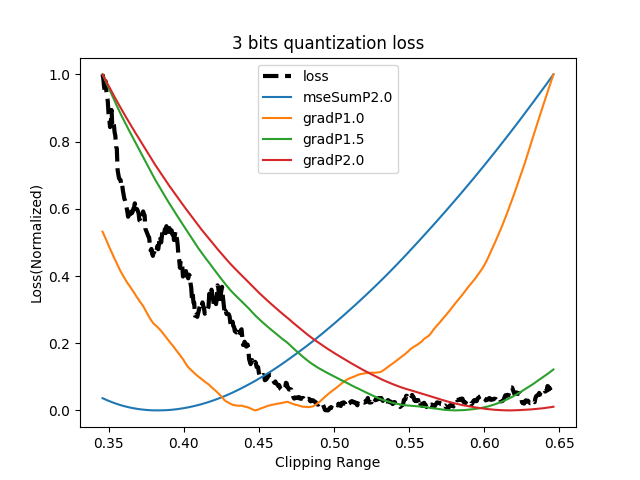

# GradQuant
DNN Quantization program using network's gradient data.

This project has two python program that runs quantization.
  - main.py : Runs gradient quantization and generate accurancy result.
  - drawPlot.py : Rad generated accuracy data and plotting.


## Getting Started
**click `Use this template` and use this template!**

### module version required

|module|version|
|--|--|
|pytorch              |     1.11.0       |
|pyyaml               |     6.0          |
|python               |     3.7.13       |
|matplotlib           |     3.5.2        |
|numpy                |     1.21.5       |
|opencv-python        |     4.3.0.36     |
|pandas               |     1.3.5        |
|pyqt                 |     5.9.2        |

## How to run
* To generate quantized result
```
$> python main.py
```
* To generate 4 bit quantized result with 100 clipping level
```
$> python main.py --quant_resolution 100 --quant_bit_start 4 --quant_bit_end 5
```
* How to draw plots
```
$> python drawPlot.py
```


* To select label that want to plot, edit drawLabe.py file

## Program Options
### main.py options
#### General Options
|option|default|type|help|
|--|--|--|--|
|--TEST| resnet18| str| project name|
|--seed| 2022| int| random seed for result reproducing|
|--arch| resnet18| str| dataset name|
|--batch_size| 64| int| mini-batch size for data loader|
|--workers| 4| int| number of workers for data loader|
|--data_path| ../data| str| path to CIFAR10Net data| required=False|

#### Training Parameters
|option|default|type|help|
|--|--|--|--|
|--max_epoch| 1| int| trainning epoch|

#### Data Loading
|option|default|type|help|
|--|--|--|--|
|--load_param      | True| bool| Load pre trained parameter|
|--load_param_path | ./data/model/resnet18_weight_test.pth| str| pretrained weight|

#### Make Grad Data
|option|default|type|help|
|--|--|--|--|
|--grad_epoch      | 16| int| run traing to make weights|
|--dump_path       | ./data/resnet18_cifar/weights| str| weight adn gradient dump path|

#### Quant Options
|option|default|type|help|
|--|--|--|--|
|--qaunt_symmetric | False| bool| weight symmetric quantization|

#### Grad Quantization
|option|default|type|help|
|--|--|--|--|
|--quant_resolution  | 100| int|     quantization resolution|
|--quant_clip_start  | 0.0| float|   quantization clipping start|
|--quant_clip_end    | 1.0| float|   quantization clipping end|
|--quant_bit_start   | 1|   int|     quantization bit start|
|--quant_bit_end     | 8|   int|     quantization bit end|
|--quant_run_eval    | False| bool|  quantization run eval data|
|--quant_use_hess    | False| bool|  quantization use hessian|
|--quant_base_data   | False| bool|  quantization save result as base data|
|--quant_result_path | ./data/resnet18_cifar/result/| str|  quantization save path|

### drawPlot.py options
|option|default|type|help|
|--|--|--|--|
|--TEST              | resnet18| str| project name|
|--quant_result_path | ./data/resnet18_cifar/result/ | str|  quantization save path|
|--dump_html_path    | ./data/resnet18_cifar/htmls/  | str|  html dump path|
|--dump_png_path     | ./data/resnet18_cifar/png/    | str|  png dump path|
|--dump_html         | True  | bool|  html dump enable|
|--dump_png          | True   | bool|  png dump enable|
|--dump_bits         | 7| str|  dumpping bits|
|--dump_acc_html     | False| bool|  dump acc html|
|--minLossArea       | True | bool|  only print minmize loss area +-0.15|

## Authors
  - [choigj](https://github.com/jai1215) - **Geunjae Choi** - <jai1215@snu.ac.kr>
